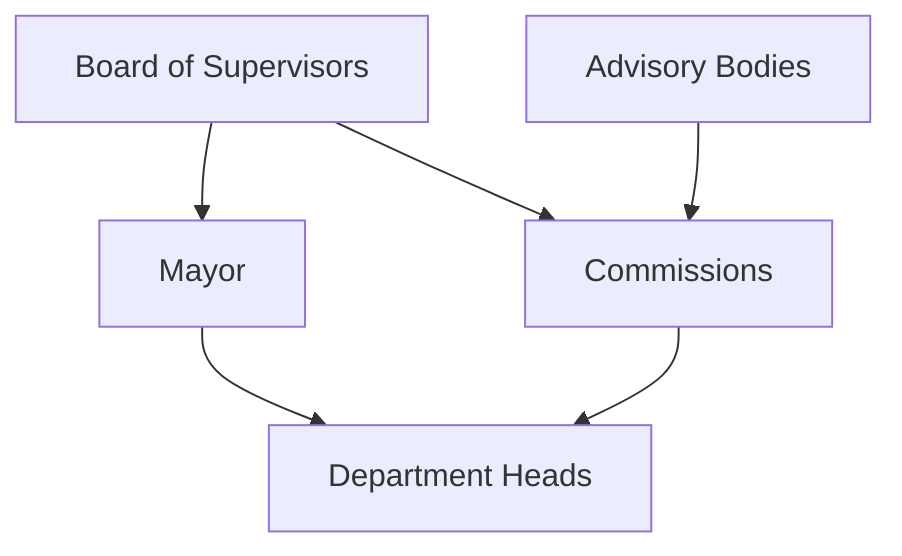
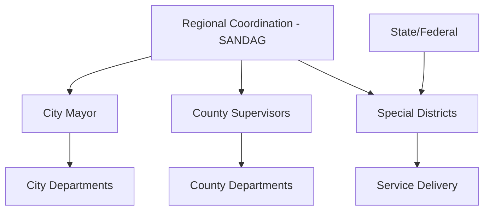

# SF vs San Diego Government Structure Comparison

## Scale and Complexity Analysis

### San Francisco CivLab Model
```
SF Government Structure (Consolidated City-County)
├── Mayor (Chief Executive)
├── Board of Supervisors (11 members)
├── City Departments (~56 departments)
├── Boards & Commissions (~54 bodies)  
├── Advisory Bodies (~75 entities)
└── Total: ~191 entities in unified system

Budget: $15.99B (single consolidated budget)
Population: 842K
Area: 47 square miles
```

### San Diego Model (Current Phase 1)
```
San Diego Government Structure (Multi-Jurisdictional)
├── CITY LEVEL
│   ├── Mayor + City Council (9 districts)
│   └── City Departments (47 mapped)
├── COUNTY LEVEL  
│   ├── Board of Supervisors (5 districts)
│   └── County Departments (47 mapped)
├── REGIONAL LEVEL
│   └── Special Districts/Authorities (10 major entities)
└── Current Total: 119 entities (Phase 1 foundation)

Estimated Complete Structure: 200+ entities
Combined Budget: ~$20B+ (fragmented across jurisdictions)
Population: 3.3M (county-wide)
Area: 4,200+ square miles
```

## Structural Differences

### SF: Unified Hierarchy


### San Diego: Multi-Layered Federation


## What Makes San Diego More Complex

### 1. Jurisdictional Fragmentation
- **SF**: Single city-county with unified authority
- **SD**: City + County + 18 municipalities + Regional authorities

### 2. Service Delivery Complexity
- **SF**: Direct city service delivery
- **SD**: Multi-agency coordination required for most services
  - Transportation: SANDAG + MTS + NCTD + Cities
  - Water: SDCWA + 23 member agencies + Cities
  - Public Safety: City Police + County Sheriff + Regional coordination

### 3. Budget Complexity
- **SF**: Single $15.99B budget with clear authority chains
- **SD**: Multiple overlapping budgets:
  - City of San Diego: ~$5.2B
  - San Diego County: ~$8.1B  
  - SANDAG: ~$600M
  - MTS: ~$700M
  - Other authorities: ~$2B+
  - **Total**: >$20B in fragmented decision-making

### 4. Democratic Representation
- **SF**: 11 supervisors for 842K people (1:76K ratio)
- **SD**: 14 supervisors/councilmembers for 3.3M people (1:235K ratio)
- **Complexity**: Multiple overlapping electoral districts and appointment authorities

## Visualization Challenges: SF vs San Diego

### SF CivLab Approach
```
Single Entity Graph:
- Clear hierarchical relationships
- Unified budget visualization  
- Straightforward appointment chains
- Single point of democratic accountability
```

### San Diego Required Approach
```
Multi-Dimensional Visualization Needed:
- Toggle between jurisdictional levels
- Cross-boundary relationship mapping
- Federated budget flow visualization
- Multiple accountability chains
- Regional coordination overlay
```

## Implementation Implications

### SF Success Factors
1. **Data Sources**: Single charter, unified budget documents
2. **Relationships**: Clear hierarchical structures
3. **User Mental Model**: "The City" as single entity
4. **Political Complexity**: Moderate (unified system)

### San Diego Additional Requirements
1. **Data Sources**: Multiple charters, fragmented budgets, inter-agency agreements
2. **Relationships**: Matrix management with regional coordination
3. **User Mental Model**: "The Region" with multiple governments
4. **Political Complexity**: High (federal system in miniature)

## User Experience Design Implications

### SF: Linear Navigation
```
Citizen Issue → Relevant Department → Department Head → Mayor/Supervisor
(2-3 clicks maximum)
```

### San Diego: Multi-Path Navigation
```
Citizen Issue → Service Level → Jurisdiction Level → Authority Level → Official
(3-5 clicks, with jurisdiction disambiguation required)

Example: Transit Issue
├── Local Route → City Transportation → City Council
├── Regional Route → SANDAG → Board of Directors  
├── County Route → County Public Works → Supervisors
└── Cross-Regional → MTS/NCTD → Independent Boards
```

## The San Diego Advantage

Despite greater complexity, San Diego's structure offers unique transparency opportunities:

### 1. Regional Government Model
- **Replicability**: Most US metros have similar fragmented structures
- **National Impact**: Success creates template for regional transparency
- **Comparative Analysis**: Multiple jurisdictions enable governance comparisons

### 2. Comprehensive Accountability Mapping
- **Complete Picture**: True cost and authority mapping across all levels
- **Democratic Innovation**: Regional democracy visualization unprecedented
- **Policy Impact**: Regional coordination visualization enables better policy decisions

### 3. Citizen Empowerment
- **Service Navigation**: Help citizens find the right government for their issue
- **Engagement Optimization**: Connect citizens to the most effective advocacy points
- **Transparency Revolution**: Make regional governance accessible for the first time

`★ Insight ─────────────────────────────────────`
**The San Diego Challenge: Turning Complexity Into Clarity**

San Francisco's success came from making a complex but unified system accessible. San Diego's opportunity is making a truly complex, federated system comprehensible. The technical and design challenges are greater, but so is the potential civic impact. Success in San Diego creates a replicable model for metropolitan government transparency nationwide.
`─────────────────────────────────────────────────`

## Next Phase Priority: Relationship Architecture

The key differentiator for San Diego will be sophisticated relationship modeling:
- **Hierarchical**: Traditional org chart relationships  
- **Functional**: Service delivery coordination
- **Financial**: Budget flows and funding relationships
- **Political**: Electoral and appointment networks
- **Geographic**: Boundary and service area overlaps

This multi-dimensional relationship architecture is what will make the San Diego model revolutionary rather than merely comprehensive.